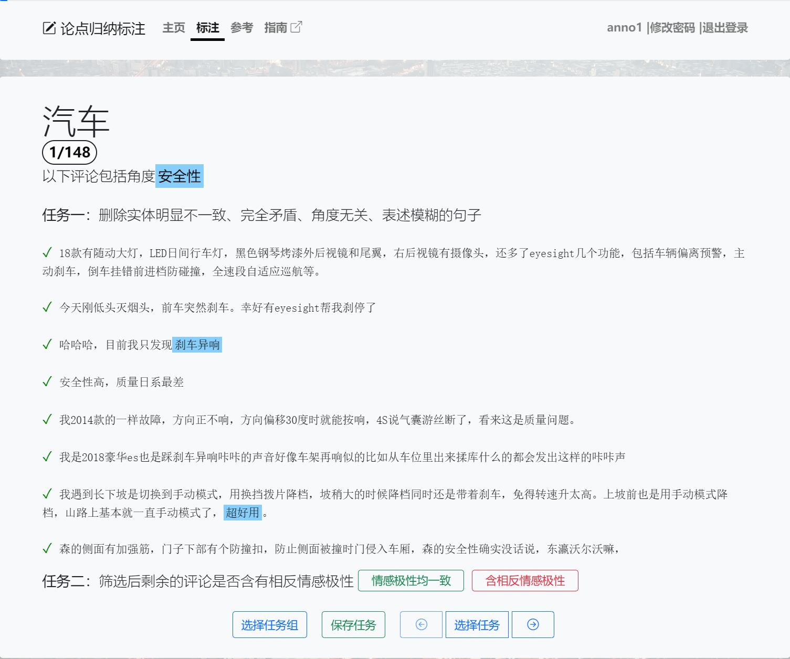
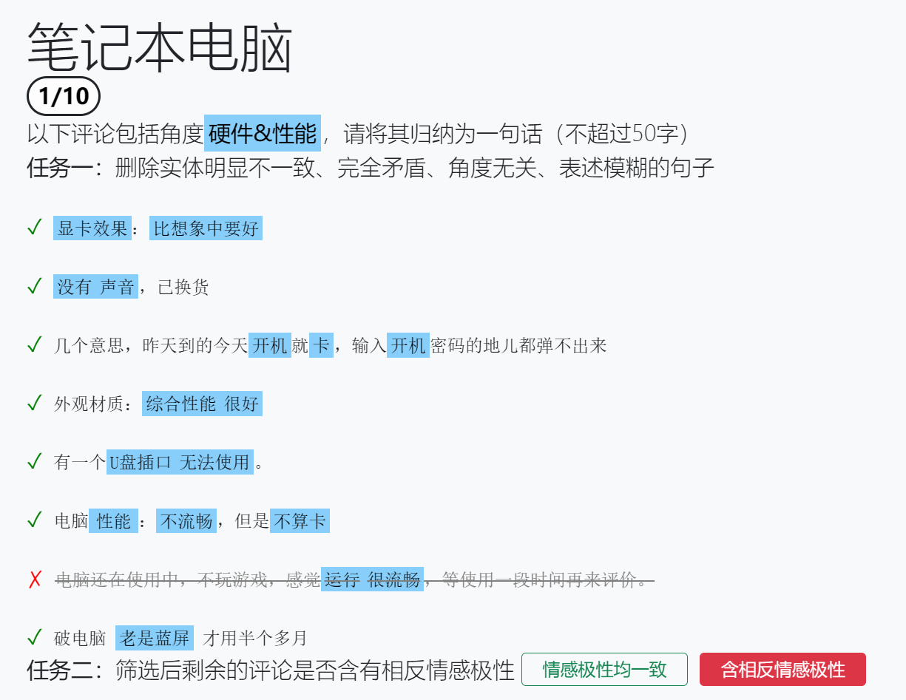

# 标注任务

评论筛选任务指对给定的多个评论进行，包括两个子任务：评论筛选，判断情感一致性。标注者需登录标注网页方可进行标注。

进入标注页面后，用户会得到一个角度以及多个评论，这些评论的情感极性不一致，即某一评论是正向表述，而另一评论是负向表述。需要强调的使，这些评论并不一定指向同一实体，并且不一定与所给角度完全相关。用户需要对所给评论进行筛选，以获得实体一致且与所给角度相关的评论。

### 任务一：评论筛选

由于所给的多条评论是由抽样得到的，可能出现部分评论完全矛盾或与其他评论不相关等的情况，因此首先需要将无效评论删除。
无效评论包括：
* 与其他大多数评论描述对象明显不一致（不包括描述实体模糊的情况）
* 与其他大多数评论的表述完全矛盾
* 与所给角度无关
* 表述模糊没有信息量

用户可点击无效评论前的勾选符号✔使其变为叉号❌，从而删除该条评论。

### 任务二：判断情感一致性

对筛选过后剩余的评论，判断情感极性是否一致，选择对应的按钮。

