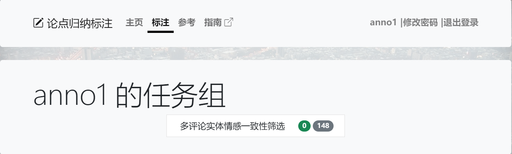
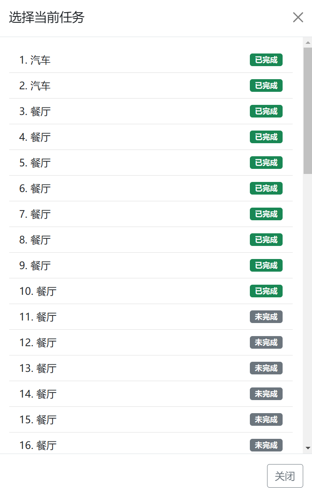

# 标注网站

标注网站的网址为 <http://47.113.193.232:4000/>，请使用分配的帐号和密码登录并完成标注任务。

## 主页与登录

标注网站主页各部分功能如下图所示。用户未登录时主页显示界面如左图，可以点击导航栏上的“登录”按钮进入登录页面，输入用户名和密码登录标注网站。登录后主页变为右图，用户可以点击“开始标注”按钮或导航栏上的“标注”按钮，开始标注任务。点击“标注指南”会打开一个新标签并跳转到本指南的首页。在任何界面点击导航栏上的“参考”按钮可以查看试标注任务的参考结果。

&emsp;&emsp;

## 任务组

点击“开始标注”后，网页将跳转到任务组选择界面，如下图所示。任务组会显示其名称与标注状态：绿色表示完成标注的任务数，灰色表示未标注的任务数。

*注：一个任务“完成”当且仅当用户对该任务完成了情感一致性判断*

点击任务组进入标注页面，并自动跳转至上次离开时正在标注的任务（新用户或网站更新后第一次访问会跳转至第一个任务）。点击导航栏上的“指南”按钮同样可以在新标签打开本指南。

下方操作栏中各按钮功能如下：
- 选择任务组：点击后返回任务组选择界面，与点击导航栏上的“标注”按钮效果相同。
- 保存任务：点击后保存当前标注。每一次标注操作都会自动保存当前标注结果，同时每次回到标注页面都会重新加载标注。
- 选择任务：点击后出现任务选择列表，点击任务进行跳转。同时可以点击左/右箭头可直接跳转到前/后一条任务。切换任务时，网页将自动保存当前任务的标注结果。

任务列表的每个条目显示了任务的实体类型和标注状态，如下图所示。其中，绿色表示任务已完成标注，如图中前十个任务；灰色表示任务尚未标注，如图中第十个任务之后的所有任务。
	

## 标注流程

*注意：标注过程中请务必保持网络连接畅通，否则当前任务的未保存修改可能会丢失；如果网页显示不正常，请检查并尝试关闭 VPN。*

用户在登陆后，进入标注组选择页面：

点击任务组进入到标注页面，完成任务一、任务二

完成后点击“保存任务”按钮完成保存，该标注任务完成，选择下一任务。

